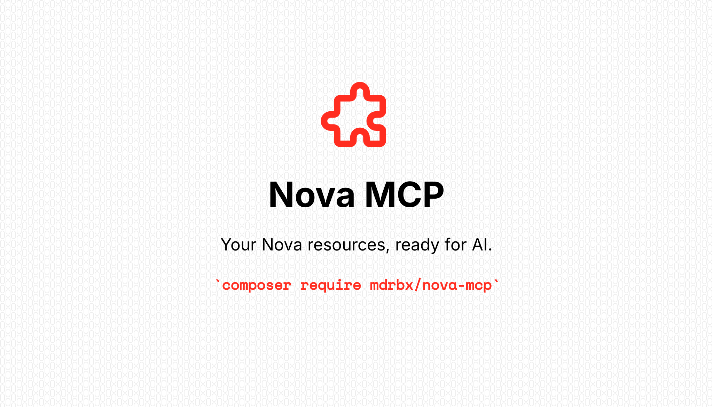

[](https://packagist.org/packages/mdrbx/nova-mcp)
[](https://github.com/mdrbx/nova-mcp/actions/workflows/ci.yml)
[](LICENSE.md)

# Nova MCP

Give your AI client access to the Laravel Nova resources you already use. ✨

Nova MCP exposes your resources through [Laravel MCP](https://laravel.com/framework/docs/13.x/mcp),
using Nova's existing policies, field visibility, validation and operations.
Users connect with their Nova account over OAuth and manage access from
**MCP connections** in Nova.

- 🔌 **Start with your existing resources.** Browse, search, edit, manage relationships
  and run synchronous actions through MCP tools.
- 🔐 **Keep Nova in charge.** Every operation respects the user's Nova permissions
  and the client's approved OAuth scopes.
- 🪶 **Keep setup light.** Blade pages, no frontend build, worker or scheduler required.

## 🧪 Try the live demo

Explore **[the Nova MCP playground](https://nova-mcp.mdrbx.com)** with fictional
clients, projects and tasks. Sign in with `demo@example.com` / `NovaDemo2026!`
and complete the reCAPTCHA check.

Connect your MCP client with OAuth at **`https://nova-mcp.mdrbx.com/nova-mcp`**.
The demo is configured for Claude.ai and ChatGPT OAuth callbacks; other clients
need their callback URL added by the operator.

> This is a shared, public workspace. Do not enter personal or confidential data.
> All changes, browser sessions and MCP connections reset every six hours:
> **00:00, 06:00, 12:00 and 18:00 UTC**. Reconnect your client after a reset.

## 🚀 Quick start

Start in an application with **PHP 8.3+, Laravel 12.41.1+ or 13.x, and Nova 5.11+**.
You'll need a valid Nova license. Composer installs Laravel MCP and Passport as
dependencies. See [full requirements](docs/installation.md#requirements).

### 1. Install

```bash
composer require mdrbx/nova-mcp
php artisan nova-mcp:install
```

Review the published migrations, then run:

```bash
php artisan migrate
```

> **Using UUID or ULID user IDs?** Adapt Passport's published `user_id` columns
> before migrating. Existing Passport installations should keep their compatible
> schema. The [installation guide](docs/installation.md) covers the details.

### 2. Add the Nova Tool

Add `new NovaMcp` to your existing `NovaServiceProvider::tools()` return array:

```php
use Mdrbx\NovaMcp\NovaMcp;

public function tools(): array
{
    return [
        // Keep your other tools here.
        new NovaMcp,
    ];
}
```

Using a custom `Nova::mainMenu`? [Add the tool's menu entry](docs/installation.md#custom-nova-menus).

### 3. Connect your client

Set `APP_URL` to your public application URL. Open **MCP connections** in Nova,
copy the server URL, then add it to your MCP client with **OAuth** authentication.
Sign in, approve the permissions, and try: **“Which resources can I access?”**

Cloud clients need a publicly reachable HTTPS endpoint. The
[connection guide](docs/clients.md) explains scopes, consent and revocation.


## 🎛️ Make it yours

Writes require both Nova's permission and an approved `nova:write` scope.
To make the whole MCP read-only, set this in `.env`:

```dotenv
NOVA_MCP_READ_ONLY=true
```

You can also set the instructions sent to MCP clients:

```dotenv
NOVA_MCP_GUARDRAILS="Ask for confirmation before destructive changes. Never export personal data."
```

Read-only mode blocks writes even for existing tokens. Guardrails guide the AI
client; they are not permission checks. Rebuild the configuration cache after
changes if your deployment uses it. [See all configuration options →](docs/configuration.md)

## 📚 Go a little further

| Guide | What's inside |
| --- | --- |
| [Installation](docs/installation.md) | Requirements, Passport keys and migrations, custom Nova menus. |
| [Configuration](docs/configuration.md) | Resource selection, read-only mode, guardrails, URLs and token lifetimes. |
| [Connecting clients](docs/clients.md) | OAuth, consent, permissions, revocation and troubleshooting. |
| [Operations](docs/operations.md) | Available tools, forms, relationships, actions and compatibility limits. |
| [Architecture](docs/architecture.md) | How the adapter reuses Nova and isolates OAuth from your application. |

## 💛 Help make it better

Found a bug or have a concrete use case to share?
[Open an issue](https://github.com/mdrbx/nova-mcp/issues), or have a look at
[the contributing guide](CONTRIBUTING.md) to get started locally.

See the [changelog](CHANGELOG.md) for releases and [security policy](SECURITY.md)
for reporting vulnerabilities privately.

Made by [Matthieu Deroubaix](https://github.com/mdrbx). Released under the
[MIT license](LICENSE.md). Laravel Nova requires its own commercial license;
Nova MCP is an independent community package.
