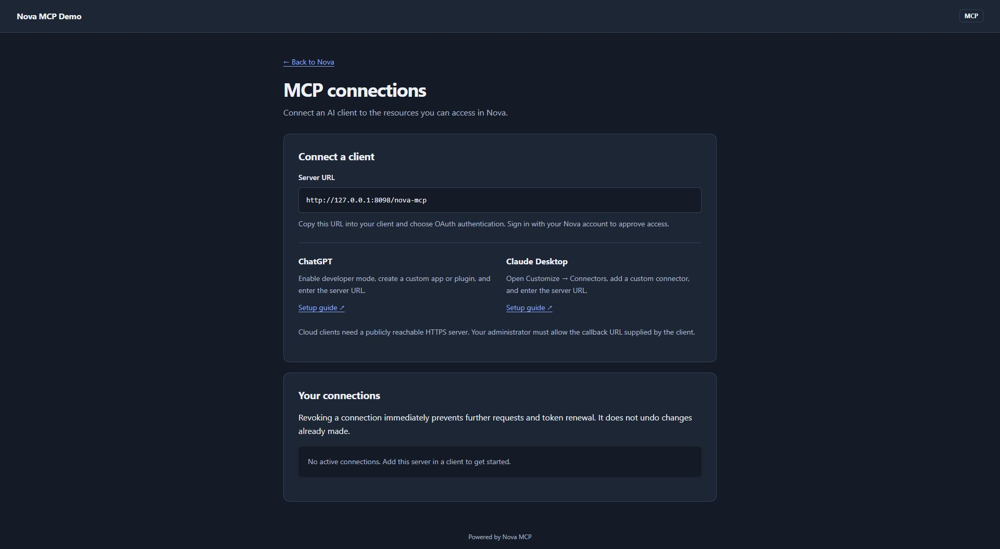
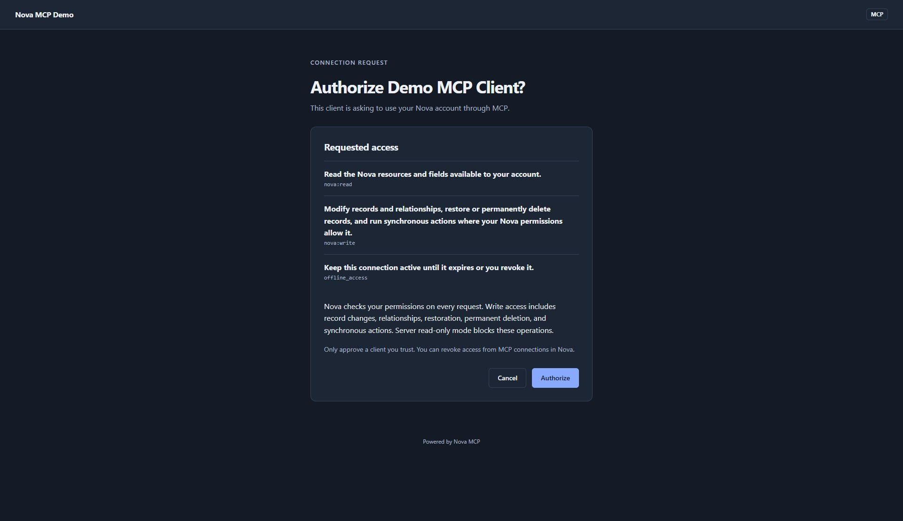

# Nova MCP

Expose Laravel Nova resources to MCP clients through the same Nova operations,
policies, field visibility, and validation used by your application.

Users connect with OAuth and manage their connections from a Nova Tool. The tool
renders Blade pages; the package has no JavaScript component or frontend build.
Requests run synchronously. No queue worker, Horizon, or scheduler is required.



Captured from the running local demo with PHP's development server and SQLite.

## Requirements

| Dependency | Version |
| --- | --- |
| PHP | 8.3+ |
| Laravel | 12.41.1+ or 13.x |
| Laravel Nova | 5.11+ |
| Laravel MCP | 1.0.1+ |
| Laravel Passport | 13.8+ |

Nova requires a separate license. This package does not include Nova source or
assets. The Composer constraints define the supported major versions; they do
not imply support for every third-party Nova field or customization.

## Install

In an application where Nova is already installed:

```bash
composer require mdrbx/nova-mcp
php artisan nova-mcp:install
```

Before migrating, check your user ID type. Passport's published `user_id` columns
default to unsigned big integers. For UUID or ULID users, adapt those columns to
the application's identifier type before running the migrations. Existing
Passport installations should retain their compatible schema.

```bash
php artisan migrate
```

Add the tool to your existing `NovaServiceProvider::tools()` method:

```php
use Mdrbx\NovaMcp\NovaMcp;

public function tools(): array
{
    return [
        new NovaMcp,
    ];
}
```

Keep any other tools already returned by that method. Open **MCP connections**
in Nova to find your server URL and manage connected clients.

The installer publishes missing configuration and Passport migrations, and
generates a Passport key pair only when neither key exists. It preserves existing
files and inline key configuration. An incomplete key pair stops installation;
restore the matching pair rather than replacing an existing key. Migrations are
never run automatically. Review them before running them in an existing application.
The package does not require changes to your user model or a `HasApiTokens` trait.
It uses its own OAuth endpoints without replacing the application's Passport
guard, authorization view, scopes, or token lifetimes.

If you define a custom `Nova::mainMenu`, include the tool's menu explicitly:

```php
(new NovaMcp)->menu($request),
```

## Configuration

The installer publishes `config/nova-mcp.php`. Defaults expose every resource
the user can access in Nova. Use `resources` to allow specific resource classes,
or `excluded_resources` to omit classes from the catalog. These restrictions
apply in addition to Nova's permissions.

The default endpoint is `/nova-mcp`. Authentication uses `nova.guard`, falling
back to the application's default guard when Nova has none configured.
Access tokens expire after 60 minutes and refresh tokens after 30 days; the
`access_token_ttl` and `refresh_token_ttl` settings use minutes and days
respectively.

Set `APP_URL` to the application's public URL before connecting clients. OAuth
uses `APP_URL` and `path` as the resource identity; changing either requires
clients to register and authorize again.

`redirect_uris` contains the expected ChatGPT and Claude OAuth callbacks. If a
client reports a different callback, add the exact HTTPS URL after checking its
official documentation. Remote callbacks must match the allowlist. `allowed_origins`
accepts additional browser origins; the application's own origin is accepted by
default. Neither setting changes which resources or operations a user can access.

## Connect a client

Use the complete server URL shown in Nova. Choose **OAuth** authentication. Public
clients register dynamically, so you do not need to create or copy a client
secret. Sign in with your Nova account and review the consent screen.

For cloud clients, the server must be reachable from the client provider. Use
HTTPS in production. A PHP development server and SQLite are sufficient for
local package development, but `localhost` is not a remotely reachable address.

### ChatGPT

1. Enable Developer mode in ChatGPT settings, if permitted by your account or
   workspace.
2. Open **Plugins → Add → Create MCP app**, give the app a name, and enter the
   complete MCP server URL from Nova.
3. Choose **OAuth**. In the advanced OAuth settings, choose dynamic client
   registration (DCR) and request `nova:read`. Add `nova:write` only if the client
   should be able to create, update, and delete records; `offline_access` is
   optional. Leave client credentials empty. Client ID Metadata Documents
   (CIMD) are not supported.
4. Create the app, sign in to Nova, and approve the requested access.
5. Select the app in a conversation and ask it to find a resource using
   `search_tools`, then execute the relevant tool.

Account permissions and interface labels vary. Follow the current
[OpenAI Developer mode guide](https://developers.openai.com/api/docs/guides/developer-mode)
for your account. This package exposes MCP tools, not a ChatGPT widget.

Video: [connect a remote MCP server with OAuth in ChatGPT (16:57)](https://www.youtube.com/watch?v=XEMZniYKuaY&t=1017s),
from Shaw Talebi's *How to Build a Remote MCP Server (with Auth)* (November 2025).
The tutorial uses another MCP server; use Nova's URL and scopes. Client menu
labels may have changed since it was recorded.

### Claude Desktop

1. Open **Customize → Connectors**.
2. Choose **+ → Add custom connector** and enter the URL from Nova.
3. Add the connector, select **Connect**, and authorize it with your Nova account.
4. Enable the connector for the conversation.

Team and Enterprise workspaces may require an owner to add the connector first.
Claude's remote connectors use Anthropic's servers, including when configured
from Claude Desktop; they cannot reach a local PHP server directly. See
[Claude's custom connector guide](https://support.claude.com/en/articles/11175166-get-started-with-custom-connectors-using-remote-mcp).

Video: [connect the remote MCP server to Claude (20:23)](https://www.youtube.com/watch?v=XEMZniYKuaY&t=1223s).
This is the Claude chapter of the same November 2025 tutorial; client menu labels
may have changed.

## Permissions

| Scope | Access |
| --- | --- |
| `nova:read` | Discover and read resources available to the Nova user. |
| `nova:write` | Request create, update, and delete operations in addition to read access. |
| `offline_access` | Request continued access through a refresh token. |

The authentication challenge requests read access by default. Write access must
be requested and approved explicitly; a write scope never overrides Nova
policies. Refresh and access tokens can be revoked from **MCP connections**.



Consent screen from the running local demo. This example requests all three
scopes; a client that only needs to read resources should request `nova:read`.

Resource policies, query restrictions, hidden fields, validation rules, model
events, and resource callbacks keep their application behavior. Hooks may send
notifications or perform other side effects. Review the application's existing
Nova permissions before granting a client write access.

## Available operations

The MCP server advertises Laravel MCP's `search_tools` and `execute_tools`. The
searchable catalog contains tools named `nova-{resource-uri-key}-{operation}`.

| Operation | Behavior |
| --- | --- |
| `index` | List and search resources, with pagination, ordering, and Nova filters. |
| `show` | Read one resource. |
| `create-fields` | Read Nova creation field metadata. |
| `update-fields` | Read Nova update field metadata for one resource. |
| `filters` | List the resource's available Nova filters. |
| `store` | Create a resource using Nova's JSON field payload. |
| `update` | Update a resource using Nova's JSON field payload. |
| `destroy` | Request deletion of one resource. |

Discover field metadata before writing. Nova validates the payload and decides
whether the user can perform the operation. A denied deletion may follow Nova's
native behavior of skipping the record rather than returning an HTTP error.

Actions, lenses, relationship mutation, file uploads, and bulk deletion are not
exposed. Custom fields that depend on browser-side behavior may need additional
integration. There is no direct Eloquent or arbitrary API request tool.

### Catalog limits

Laravel MCP currently defaults to 25 calls and 65,536 bytes per ToolSearch batch.
The package trims index presentation metadata while retaining field values and
pagination. Request smaller pages when records have large field values.

Calls run in order and stop on the first error. A batch is not a transaction:
earlier writes remain committed if a later call fails or output exceeds the
limit. Do not retry an entire write batch without checking completed operations.
See [Laravel MCP's searchable catalogs](https://laravel.com/framework/docs/13.x/mcp#searchable-tool-catalogs).

## Development

See [CONTRIBUTING.md](CONTRIBUTING.md) for licensed Nova setup, tests, and CI.
The [architecture notes](docs/architecture.md) explain OAuth isolation, Nova's
request lifecycle, and the adapter's compatibility boundaries.

```bash
composer test
composer analyse
composer format:check
composer refactor:check
```

Report vulnerabilities using [SECURITY.md](SECURITY.md). Changes are recorded in
[CHANGELOG.md](CHANGELOG.md).

## License

MIT, copyright Matthieu Deroubaix. See [LICENSE.md](LICENSE.md).
Laravel Nova is a separate, commercially licensed dependency. Nova MCP is an
independent community package and is not an official Laravel product.
